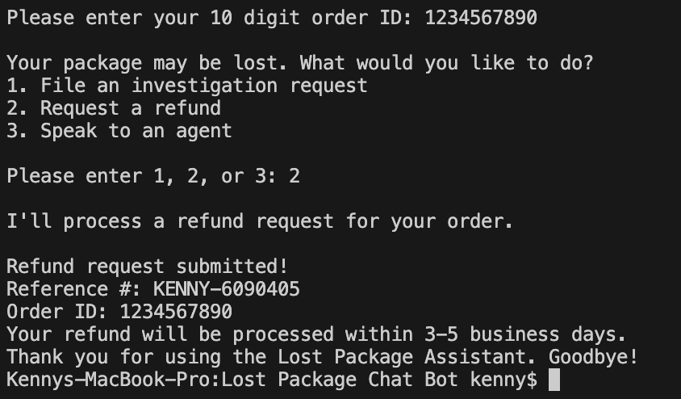
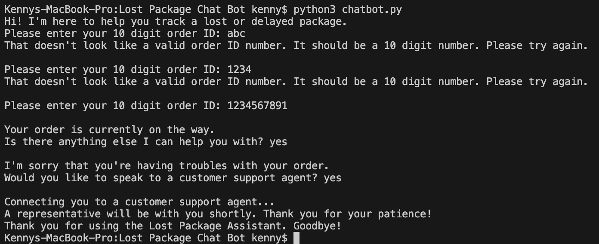
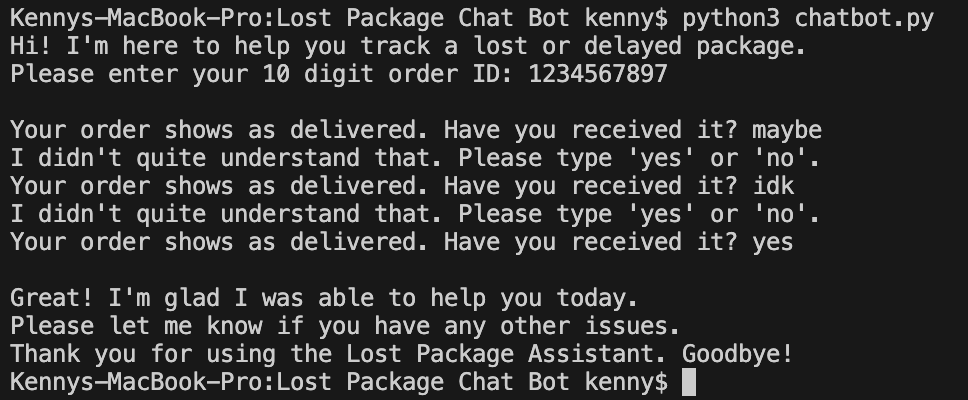
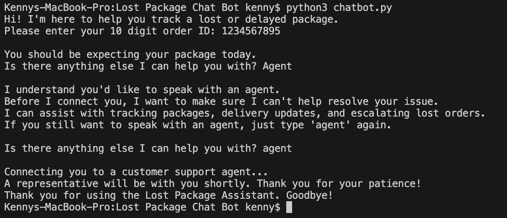
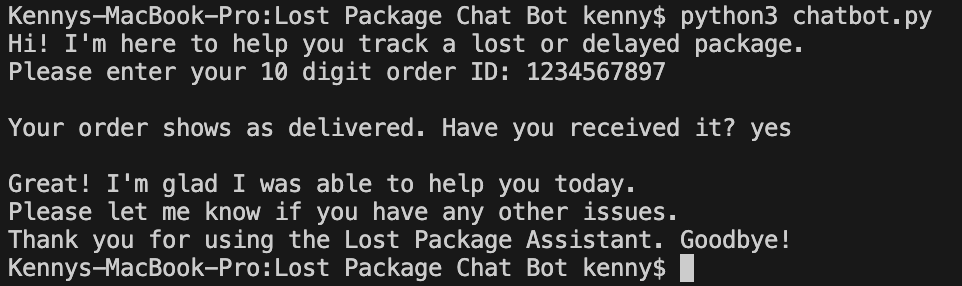

# Lost Package Tracking Chatbot

A simple Python command line chatbot that helps customers track lost or delayed packages.

## Setup & Installation

### Prerequisites
- Python 3.x installed on your system

### Running the Chatbot
```bash
cd "Lost Package Chat Bot"
python3 chatbot.py
```

No additional dependencies required, only uses Python standard libraries.

---

## Approach

### Design Philosophy
I designed this chatbot with an AI first approach encouraging users to interact with the automated system while still providing a path to human support when needed.

### Conversation Flow
1. **Welcome** → Greet the user
2. **Order ID Input** → Validate 10-digit order ID
3. **Status Check** → Display one of four statuses:
   - **Possibly Lost** → Offer self-service options (investigation, refund, or agent)
   - **In Transit** → Offer additional help
   - **Out For Delivery** → Offer additional help
   - **Delivered** → Confirm receipt
4. **Solution** → End conversation or connect to agent

### Key Features

| Feature | Description |
|---------|-------------|
| **Order Validation** | Ensures order ID is exactly 10 digits |
| **Multiple Statuses** | Handles 4 different package states |
| **Self-Service Options** | For lost packages: file investigation, request refund, or speak to agent |
| **Agent Shortcut** | Users can type "agent" at any prompt to request human support |
| **Soft Redirect** | First "agent" request encourages AI usage; second request escalates |
| **Case Insensitive** | Accepts "YES", "yes", "Yes", etc. |

### Error Handling

1. **Invalid Order ID**: If the user enters something other than a 10-digit number, the chatbot prompts them to try again.

2. **Unexpected Yes/No Response**: If the user types something other than "yes" or "no", the chatbot asks them to clarify.

---

## Examples

### Example 1: Package In Transit
```
Hi! I'm here to help you track a lost or delayed package.
Please enter your 10 digit order ID: 1234567891

Your order is currently on the way.
Is there anything else I can help you with? no
Thank you for using the Lost Package Assistant. Goodbye!
```

### Example 2: Package Delivered - Confirmed
```
Hi! I'm here to help you track a lost or delayed package.
Please enter your 10 digit order ID: 1234567897

Your order shows as delivered. Have you received it? yes

Great! I'm glad I was able to help you today.
Please let me know if you have any other issues.
Thank you for using the Lost Package Assistant. Goodbye!
```

### Example 3: Possibly Lost - File Investigation (Self-Service)
```
Hi! I'm here to help you track a lost or delayed package.
Please enter your 10 digit order ID: 1234567890

Your package may be lost. What would you like to do?
1. File an investigation request
2. Request a refund
3. Speak to an agent

Please enter 1, 2, or 3: 1

I'll file an investigation request for your package.

Investigation request submitted!
Reference #: KENNY-1234567
Order ID: 1234567890
You'll receive an email update within 24-48 hours.
Thank you for using the Lost Package Assistant. Goodbye!
```

### Example 4: Possibly Lost - Request Refund (Self-Service)
```
Hi! I'm here to help you track a lost or delayed package.
Please enter your 10 digit order ID: 1234567890

Your package may be lost. What would you like to do?
1. File an investigation request
2. Request a refund
3. Speak to an agent

Please enter 1, 2, or 3: 2

I'll process a refund request for your order.

Refund request submitted!
Reference #: KENNY-7654321
Order ID: 1234567890
Your refund will be processed within 3-5 business days.
Thank you for using the Lost Package Assistant. Goodbye!
```

### Example 5: Invalid Order ID (Error Handling)
```
Hi! I'm here to help you track a lost or delayed package.
Please enter your 10 digit order ID: abc123
That doesn't look like a valid order ID number. It should be a 10 digit number. Please try again.

Please enter your 10 digit order ID: 1234567890
...
```

### Example 6: Agent Request with Soft Redirect
```
Hi! I'm here to help you track a lost or delayed package.
Please enter your 10 digit order ID: agent

I understand you'd like to speak with an agent.
Before I connect you, I want to make sure I can't help resolve your issue.
I can assist with tracking packages, delivery updates, and escalating lost orders.
If you still want to speak with an agent, just type 'agent' again.

Please enter your 10 digit order ID: agent

Connecting you to a customer support agent...
A representative will be with you shortly. Thank you for your patience!
Thank you for using the Lost Package Assistant. Goodbye!
```

---

## Conversation Flowchart


---

## Screenshots

### Self-Service Refund Request


### Error Handling - Invalid Order ID


### Error Handling - Invalid Yes/No Response


### Agent Soft Redirect


### Success Route - Package Delivered


---

## Project Structure

```
Lost Package Chat Bot/
├── chatbot.py        # Main chatbot implementation
├── README.md         # This file
└── test-images/      # Screenshots
    ├── RefundRequest.png
    ├── OrderIDErrorCatch.png
    ├── YesNoErrorCatch.png
    ├── AgentRedirect.png
    └── SuccessRoute.png
```

---

## How It Works (Technical)

The chatbot simulates order status based on the **last digit** of the order ID:

| Last Digit | Status |
|------------|--------|
| 0 | Possibly Lost |
| 1-3 | In Transit |
| 4-6 | Out For Delivery |
| 7-9 | Delivered |

*In a production system, this would query a real order database or shipping carrier API.*
